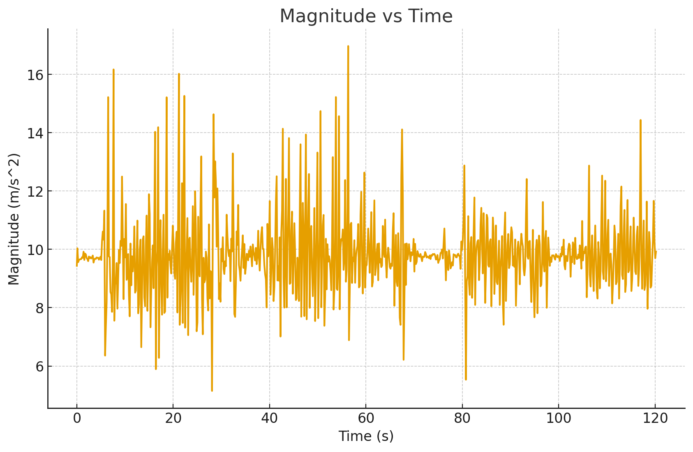
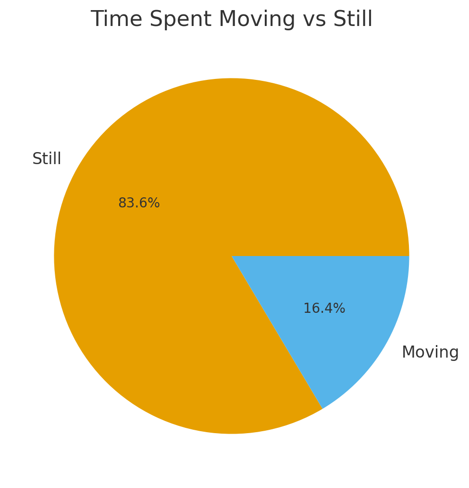

# Analyzing Sensor Data

This app is a tool for getting data from sensors and analyzing it. 
Specifically, in this lab you will gather data from the accelerometer sensors, and do some basic analysis on it (without using machine learning). 
For now, don't worry about accuracy.

## Lab Task
- This app has two buttons: Start Recording and Stop Recording.
- Start Recording records accelerometer data (timestamp, x, y, z).
- Stop Recording then saves this file to a csv in your Downloads directory.

### Task 0
- Your first task is to record about 1500 samples using the app. This should take about 5 minutes. 
- All you need to do is open the app, click "Start Recording" and then move around.
- Make sure you have periods of staying still, and periods of moving around.
- The app will display the number of entries recorded, so you know when you are done.
- 
### Task 1
- Now, you are an analyst from this app's company, who just got the sensor value.
- You want to know how much movement this user did.
- Use [Lab Task 1](lab5_task1.py)
- First, we want to do some data treatment: timestamp is recorded in total seconds, which is not very useful. Subtract the first timestamp's value from every other timestamp,
- so it looks like 0 seconds, 1 seconds... etc.
- Then, it will calculate magnitude (the square root of X squared + Y squared + Z squared from your accelerometer)
- Your job is to plot magnitude vs time.
- The graph is proof of completion of this task.

 

### Task 2
- Open [Lab Task 2](lab5_task2.py)
- Now, you want to pick a value of magnitude, above which you were moving and below which you were still. Try numbers around 10.
- Replace the variable "threshold" with this number.
- Run the code. It will generate a pie chart that shows "how often" you were moving.
- Try different numbers, if you want.
- The pie chart is proof of completion of this task.

 


 ### Questions to consider
 - Was your estimated % of time moving and still accurate? Why or why not?
 - Why do we get magnitudes below 9.8, when gravity is always 9.8 m/s^2?
 - How do we accomodate these values?
  
 

- That concludes today's lab.
 ## Step-by-Step Installation Guide for Students

### **Prerequisites**
- Android Studio (latest stable version)
- An Android phone (USB debugging enabled)

---

### **Running this App**

1. **Open Android Studio**
   - Click **“Get from VCS”** on the welcome screen.
   - Paste this repository URL:
     ```
     https://github.com/urynb/SensorLabApp.git
     ```
   - Click **Clone**.

2. **Wait for Gradle sync**
   - Let Android Studio finish downloading dependencies (bottom bar progress).

3. **Connect your Android device**
   - On your phone, go to:
     ```
     Settings → Developer options → USB debugging → ON
     ```
   - Connect via USB, and allow debugging permissions.
  
    - If this does not work or you don't have a USB cable, build an APK and download that on your phone.
    - see https://www.geeksforgeeks.org/android/methods-of-generating-apk-of-android-application/

4. **Build the project**
   - Click **Build → Make Project**   
   - Wait for “Build successful”.

5. **Run the app**
   - Choose your phone or emulator in the **device selector**.
   - Click **Run ▶️**.
